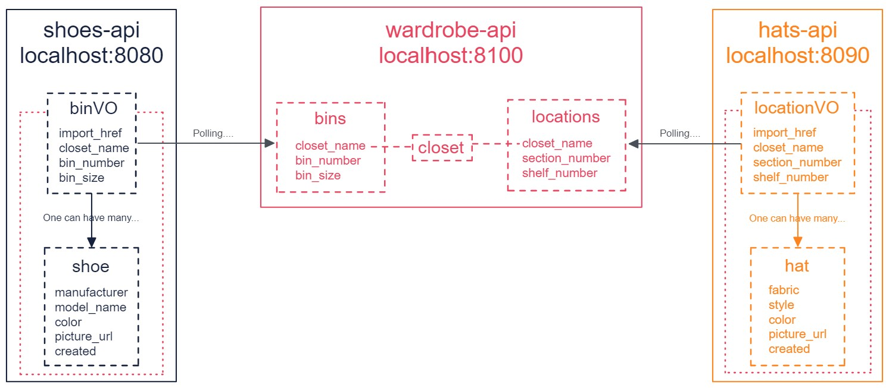

# **Wardrobify**

A Python/Django-based web app with a JS/React-integrated front-end that provides a solution to tracking your shoes and hats in your wardrobe.

---
Team:

* **Person 1:** Martey (Shoes)
* **Person 2:** Jeff (Hats)

# Table of Contents

[**Wardrobify**](#wardrobify)
  - [Design](#design)
  - [Setup Guide](#setup-guide)
  - [Need to reset your PostgreSQL database?](#need-to-reset-your-postgresql-database)
  - [Shoes microservice](#shoes-microservice)
    - [RESTful Shoes API](#restful-shoes-api)
    - [Get a list of all shoes or filter by bin](#get-a-list-of-all-shoes-or-filter-by-bin)
    - [Get the details of a shoe](#get-the-details-of-a-shoe)
    - [Create a shoe](#create-a-shoe)
    - [Create a shoe without an existing bin](#create-a-shoe-without-an-existing-bin)
    - [Delete a shoe](#delete-a-shoe)
    - [Delete a deleted shoe](#delete-a-deleted-shoe)
  - [Hats microservice](#hats-microservice)
    - [RESTful Hats API](#restful-hats-api)
    - [Get a list of all hats or filter by location](#get-a-list-of-all-hats-or-filter-by-location)
    - [Get the details of a hat](#get-the-details-of-a-hat)
    - [Create a hat](#create-a-hat)
    - [Create a hat without an existing location](#create-a-hat-without-an-existing-location)
    - [Delete a hat](#delete-a-hat)
    - [Delete a deleted hat](#delete-a-deleted-hat)
## Setup Guide
---
### 1. Get Docker [here](https://docs.docker.com/get-docker/) or using your terminal:

- **MacOS**

        brew install --cask docker

-  **Windows**

        winget install Docker.DockerDesktop

### 2. Run the Docker Application

### 3. **Fork** [this](https://gitlab.com/Jeffery-Hebert/microservice-two-shot) repository and then **clone** into a local directory

### 4. Create a Docker volume for your PostgreSQL database

```
docker volume create pgdata
```

### 5. Build your Docker images

```
docker-compose build
```

### 6. Spin up your Docker containers

```
docker-compose up
```

### 7. Congratulations, your Wardrobify web app is ready and accessible by visiting http://localhost:3000/

## Need to reset your PostgreSQL database?
---

### 1. Stop all services

### 2. Prune your Docker containers

    docker container prune -f

### 3 Delete your existing PostgreSQL database

    docker volume rm pgdata

### 4. Create a new PostgreSQL database

    docker volume create pgdata

### 5. Restart your Docker containers

    docker-compose up

## Design
---

- front-end: http://localhost:3000/

- wardrobe-api: http://localhost:8100/

- shoes-api: http://localhost:8080/

- hats-api: http://localhost:8090/
## Shoes microservice
---
The `shoes-api` microservice takes care of the tracking for all pairs of shoes in your wardrobe through its integration with the `wardrobe-api`.

One or more `Shoes` can only be stored inside `Bins`, which are created through the `wardrobe-api`. Because this microservice is a separate service from the `wardrobe-api`, it is necessary for this microservice to generate an immutable copy of all existing bins (thereby making use of **Bin Value Objects** or `BinVOs`) that have been created through the `wardrobe-api` via **`polling`**.

Since the `BinVO` model is merely a copy of the actual `Bin` in the wardrobe-api, the `BinVO` model in this microservice is patterned after the `Bin` model (i.e. closet name, bin number, and bin size attributes) in the wardrobe-api, with the exception of an `import_href` field, which establishes a relationship between the `Bin` and corresponding `BinVO`.

When a `Bin` from the `wardrobe-api` is deleted, all `Shoes` linked to that bin must also be deleted. For that reason, the `Shoe` model is linked to the `BinVO` model in a many-to-one relationship via a Foreign Key with an on-delete cascade setting, on top of defining attributes needed to track your shoes (e.g. manufacturer, model name, color, and picture). The process of `Bin` deletion is accomplished by sending a delete request for a `Bin` to the `wardrobe-api`, programmatically triggering another delete request for the corresponding `BinVO` sent to this microservice, which causes a cascade of deletions of all related `Shoes`.

The models are described below.

**Shoe**

| Attribute    |       Type        |      Options      |
| ------------ | :---------------: | :---------------: |
| manufacturer |      string       |  max. 200 chars   |
| model_name   |      string       |  max. 200 chars   |
| color        |      string       |  max. 100 chars   |
| picture_url  |      string       |        url        |
| created      |     datetime      | auto_now_add=True |
| bin          | ForeignKey object | on_delete cascade |

**BinVO**

| Attribute   |  Type  |    Options     |
| ----------- | :----: | :------------: |
| closet_name | string | max. 100 chars |
| bin_number  |  int   |    smallint    |
| bin_size    |  int   |    smallint    |
| import_href | string |     unique     |

### RESTful Shoes API
---
The REST API for the shoes microservice is detailed below.

| Method | URL                  | What it does                             |
| ------ | :------------------- | :--------------------------------------- |
| GET    | /api/shoes/          | Gets a list of shoes                     |
| GET    | /api/bins/:id/shoes/ | Gets a list of shoes in a particular bin |
| GET    | /api/shoes/:id/      | Gets the details of a shoe               |
| POST   | /api/shoes/          | Creates a shoe                           |
| DELETE | /api/shoes/:id/      | Deletes a shoe                           |

### Get a list of all shoes or filter by bin
---
#### **Request**

`GET /api/shoes/`

    http://localhost:8080/api/shoes/

`GET /api/bins/:id/shoes/`

    http://localhost:8080/api/bins/1/shoes/

#### **Response**

```yaml
< HTTP/1.1 200 OK
< Date: Mon, 05 Dec 2022 08:43:10 GMT
< Server: WSGIServer/0.2 CPython/3.10.8
< Content-Type: application/json
< X-Frame-Options: DENY
< Content-Length: 742
< X-Content-Type-Options: nosniff
< Referrer-Policy: same-origin
< Cross-Origin-Opener-Policy: same-origin
< Vary: Origin
```
```json
{
    "shoes": [
        {
            "href": "/api/shoes/1/",
            "manufacturer": "Nike",
            "model_name": "Air Jordan 1 Mid",
            "color": "Red",
            "bin": 1,
            "closet_name": "My Closet"
        },
        {
            "href": "/api/shoes/2/",
            "manufacturer": "Adidas",
            "model_name": "Ultra 4DFWD Shoes",
            "color": "Olive green",
            "bin": 1,
            "closet_name": "My Closet"
        },
        {
            "href": "/api/shoes/3/",
            "manufacturer": "Nike",
            "model_name": "Blazer Mid '77 Vintage",
            "color": "White",
            "bin": 2,
            "closet_name": "Mom's Closet"
        }
    ]
}
```

##### Without any shoes, or no shoes in the specified bin:
```json
{
    "shoes": []
}
```

### Get the details of a shoe
---
#### **Request**

`GET /api/shoes/:id`

    http://localhost:8080/api/shoes/1/

#### **Response**

```yaml
< HTTP/1.1 200 OK
< Date: Mon, 05 Dec 2022 08:53:34 GMT
< Server: WSGIServer/0.2 CPython/3.10.8
< Content-Type: application/json
< X-Frame-Options: DENY
< Content-Length: 413
< X-Content-Type-Options: nosniff
< Referrer-Policy: same-origin
< Cross-Origin-Opener-Policy: same-origin
< Vary: Origin
```
```json
{
    "href": "/api/shoes/1/",
    "manufacturer": "Nike",
    "model_name": "Air Jordan 1 Mid",
    "color": "Red",
    "picture_url": "https://static.nike.com/a/images/t_PDP_864_v1/f_auto,b_rgb:f5f5f5/0e7fc8f3-76b7-4631-b147-4dad4b1ff241/air-jordan-1-mid-shoes-M2KS6n.png",
    "created": "2022-12-05T08:47:30.071198+00:00",
    "bin": {
        "closet_name": "My Closet",
        "bin_number": 5,
        "bin_size": 2,
        "import_href": "/api/bins/1/",
        "id": 1
    }
}
```

### Get the details of a shoe that does not exist
---
#### **Request**

`GET /api/shoes/:id`

    http://localhost:8080/api/shoes/1/

#### **Response**

```yaml
< HTTP/1.1 400 Bad Request
< Date: Mon, 05 Dec 2022 09:14:37 GMT
< Server: WSGIServer/0.2 CPython/3.10.8
< Content-Type: application/json
< X-Frame-Options: DENY
< Content-Length: 30
< X-Content-Type-Options: nosniff
< Referrer-Policy: same-origin
< Cross-Origin-Opener-Policy: same-origin
< Vary: Origin
```
```json
{
    "message": "Invalid shoe id"
}
```

### Create a shoe
---
#### **Request**

`POST /api/shoes/`

    http://localhost:8080/api/shoes/

```json
{
    "manufacturer": "Nike",
    "model_name": "Air Jordan 1 Mid",
    "color": "Red",
    "picture_url": "https://static.nike.com/a/images/t_PDP_864_v1/f_auto,b_rgb:f5f5f5/0e7fc8f3-76b7-4631-b147-4dad4b1ff241/air-jordan-1-mid-shoes-M2KS6n.png",
    "bin": 1
}
```

#### **Response**
```yaml
< HTTP/1.1 200 OK
< Date: Mon, 05 Dec 2022 09:10:57 GMT
< Server: WSGIServer/0.2 CPython/3.10.8
< Content-Type: application/json
< X-Frame-Options: DENY
< Content-Length: 413
< X-Content-Type-Options: nosniff
< Referrer-Policy: same-origin
< Cross-Origin-Opener-Policy: same-origin
< Vary: Origin
```

```json
{
    "href": "/api/shoes/1/",
    "manufacturer": "Nike",
    "model_name": "Air Jordan 1 Mid",
    "color": "Red",
    "picture_url": "https://static.nike.com/a/images/t_PDP_864_v1/f_auto,b_rgb:f5f5f5/0e7fc8f3-76b7-4631-b147-4dad4b1ff241/air-jordan-1-mid-shoes-M2KS6n.png",
    "created": "2022-12-05T08:47:30.071198+00:00",
    "bin": {
        "closet_name": "My Closet",
        "bin_number": 5,
        "bin_size": 2,
        "import_href": "/api/bins/1/",
        "id": 1
    }
}
```

### Create a shoe without an existing bin
---
#### **Request**

`POST /api/shoes/`

    http://localhost:8080/api/shoes/

```json
{
    "manufacturer": "Nike",
    "model_name": "Air Jordan 1 Mid",
    "color": "Red",
    "picture_url": "https://static.nike.com/a/images/t_PDP_864_v1/f_auto,b_rgb:f5f5f5/0e7fc8f3-76b7-4631-b147-4dad4b1ff241/air-jordan-1-mid-shoes-M2KS6n.png",
    "bin": 9999
}
```
#### **Response**
```yaml
< HTTP/1.1 400 Bad Request
< Date: Mon, 05 Dec 2022 09:17:41 GMT
< Server: WSGIServer/0.2 CPython/3.10.8
< Content-Type: application/json
< X-Frame-Options: DENY
< Content-Length: 26
< X-Content-Type-Options: nosniff
< Referrer-Policy: same-origin
< Cross-Origin-Opener-Policy: same-origin
< Vary: Origin
```

```json
{
    "message": "Invalid input for bin, or bin not found"
}
```

### Delete a shoe
---
#### **Request**

`DELETE /api/shoes/:id`

    http://localhost:8080/api/shoes/1/

#### **Response**

```yaml
< HTTP/1.1 200 OK
< Date: Mon, 05 Dec 2022 09:11:10 GMT
< Server: WSGIServer/0.2 CPython/3.10.8
< Content-Type: application/json
< X-Frame-Options: DENY
< Content-Length: 17
< X-Content-Type-Options: nosniff
< Referrer-Policy: same-origin
< Cross-Origin-Opener-Policy: same-origin
< Vary: Origin
```

```json
    {
        "deleted": true
    }
```

### Delete a deleted shoe
---
#### **Request**

`DELETE /api/shoes/:id`

    http://localhost:8080/api/shoes/1/

#### **Response**

```yaml
< HTTP/1.1 200 OK
< Date: Mon, 05 Dec 2022 09:08:30 GMT
< Server: WSGIServer/0.2 CPython/3.10.8
< Content-Type: application/json
< X-Frame-Options: DENY
< Content-Length: 18
< X-Content-Type-Options: nosniff
< Referrer-Policy: same-origin
< Cross-Origin-Opener-Policy: same-origin
< Vary: Origin
```

```json
{
    "deleted": false
}
```


## Hats microservice
---
The `hats-api` microservice takes care of the tracking for all hats in your wardrobe through its integration with the `wardrobe-api`.

One or more `Hats` can only be stored inside `Locations`, which are created through the `wardrobe-api`. Because this microservice is a separate service from the `wardrobe-api`, it is necessary for this microservice to generate an immutable copy of all existing locations (thereby making use of **Location Value Objects** or `LocationVOs`) that have been created through the `wardrobe-api` via **`polling`**.

Since the `LocationVO` model is merely a copy of the actual `Location` in the wardrobe-api, the `LocationVO` model in this microservice is patterned after the `Location` model (i.e. closet name, section number, and shelf number attributes) in the wardrobe-api, with the exception of an `import_href` field, which establishes a relationship between the `Location` and corresponding `LocationVO`.

When a `Location` from the `wardrobe-api` is deleted, all `Hats` linked to that location  must also be deleted. For that reason, the `Hat` model is linked to the `LocationVO` model in a many-to-one relationship via a Foreign Key with an on-delete cascade setting, on top of defining attributes needed to track your hats (e.g. manufacturer, model name, color, and picture). The process of `Location` deletion is accomplished by sending a delete request for a `Location` to the wardrobe-api, programmatically triggering another delete request for the corresponding `LocationVO` sent to this microservice, which causes a cascade of deletions of all related `Hats`.

The models are described below.


**Hat**

| Attribute   |       Type        |      Options      |
| ----------- | :---------------: | :---------------: |
| fabric      |      string       |     250 chars     |
| style       |      string       |     250 chars     |
| color       |      string       |     250 chars     |
| picture_url |      string       |        url        |
| created     |     datetime      |                   |
| location    | ForeignKey object | on_delete cascade |

**LocationVO**

| Attribute      |  Type  |  Options  |
| -------------- | :----: | :-------: |
| closet_name    | string | 100 chars |
| section_number |  int   | smallint  |
| shelf_number   |  int   | smallint  |
| import_href    | string |  unique   |

### RESTful Hats API
---
The REST API for the shoes microservice is detailed below.

| Method | URL                      | What it does                            |
| ------ | :----------------------- | :-------------------------------------- |
| GET    | /api/hats/               | Gets a list of hats                     |
| GET    | /api/locations/:id/hats/ | Gets a list of hats in a particular bin |
| GET    | /api/shoes/:id/          | Gets the details of a hat               |
| POST   | /api/shoes/              | Creates a hat                           |
| DELETE | /api/shoes/:id/          | Deletes a hat                           |
### Get a list of all hats or filter by location
---
#### **Request**

`GET /api/hats/`

    http://localhost:8090/api/hats/

`GET /api/locations/:id/hats/`

    http://localhost:8090/api/bins/1/hats/

#### **Response**

```yaml
< HTTP/1.1 200 OK
< Date: Mon, 05 Dec 2022 20:31:27 GMT
< Server: WSGIServer/0.2 CPython/3.10.8
< Content-Type: application/json
< X-Frame-Options: DENY
< Content-Length: 735
< X-Content-Type-Options: nosniff
< Referrer-Policy: same-origin
< Cross-Origin-Opener-Policy: same-origin
< Vary: Origin
```
```json
{
	"hats": [
		{
			"href": "/api/hats/19/",
			"id": 19,
			"style": "Baseball cap",
			"fabric": "Yankees Hat",
			"color": "Blue",
			"picture_url": "https://www.mickeysplace.com/wp-content/uploads/2020/12/1960-Yankees-Front.jpg",
			"location": "Master"
		},
		{
			"href": "/api/hats/22/",
			"id": 22,
			"style": "Bucket",
			"fabric": "Metal",
			"color": "Gray",
			"picture_url": "https://imgprd19.hobbylobby.com/sys-master/migrated/h92/h60/h00/9048387059742/972216[6].jpg",
			"location": "Master"
		},
		{
			"href": "/api/hats/23/",
			"id": 23,
			"style": "fedora",
			"fabric": "woold",
			"color": "black",
			"picture_url": "https://isteam.wsimg.com/ip/7c9c96eb-abec-11e4-8625-14feb5d9f2e6/ols/130_original/:/rs=w:600,h:600",
			"location": "Master"
		}
	]
}
```
##### Without any hats, or no hats in the specified location:
```json
{
    "hats": []
}
```

### Get the details of a hat
---
#### **Request**

`GET /api/hats/:id`

    http://localhost:8090/api/hats/19/

#### **Response**

```yaml
< HTTP/1.1 200 OK
< Date: Mon, 05 Dec 2022 20:37:05 GMT
< Server: WSGIServer/0.2 CPython/3.10.8
< Content-Type: application/json
< X-Frame-Options: DENY
< Content-Length: 351
< X-Content-Type-Options: nosniff
< Referrer-Policy: same-origin
< Cross-Origin-Opener-Policy: same-origin
< Vary: Origin
```
```json
{
	"href": "/api/hats/19/",
	"fabric": "Yankees Hat",
	"style": "Baseball cap",
	"color": "Blue",
	"picture_url": "https://www.mickeysplace.com/wp-content/uploads/2020/12/1960-Yankees-Front.jpg",
	"created": "2022-12-05T18:35:15.515251+00:00",
	"location": {
		"closet_name": "Master",
		"section_number": 1,
		"shelf_number": 1,
		"import_href": "/api/locations/1/"
	}
}
```

### Get the details of a hat that does not exist
---
#### **Request**

`GET /api/hats/:id`

    http://localhost:8090/api/hats/1/

#### **Response**

```yaml
< HTTP/1.1 400 Bad Request
< Date: Mon, 05 Dec 2022 20:37:27 GMT
< Server: WSGIServer/0.2 CPython/3.10.8
< Content-Type: application/json
< X-Frame-Options: DENY
< Content-Length: 29
< X-Content-Type-Options: nosniff
< Referrer-Policy: same-origin
< Cross-Origin-Opener-Policy: same-origin
< Vary: Origin
```
```json
{
	"message": "Invalid Hat ID"
}
```

### Create a hat
---
#### **Request**

`POST /api/hats/`

    http://localhost:8090/api/hats/

```json
{
		"fabric" : "woold",
    "style" : "fedora",
    "color" : "black",
    "picture_url" : "https://isteam.wsimg.com/ip/7c9c96eb-abec-11e4-8625-14feb5d9f2e6/ols/130_original/:/rs=w:600,h:600",
		"location" : 1
}
```

#### **Response**
```yaml
< HTTP/1.1 200 OK
< Date: Mon, 05 Dec 2022 20:38:01 GMT
< Server: WSGIServer/0.2 CPython/3.10.8
< Content-Type: application/json
< X-Frame-Options: DENY
< Content-Length: 360
< X-Content-Type-Options: nosniff
< Referrer-Policy: same-origin
< Cross-Origin-Opener-Policy: same-origin
< Vary: Origin
```

```json
{
	"href": "/api/hats/23/",
	"fabric": "woold",
	"style": "fedora",
	"color": "black",
	"picture_url": "https://isteam.wsimg.com/ip/7c9c96eb-abec-11e4-8625-14feb5d9f2e6/ols/130_original/:/rs=w:600,h:600",
	"created": "2022-12-05T20:38:01.539945+00:00",
	"location": {
		"closet_name": "Master",
		"section_number": 1,
		"shelf_number": 1,
		"import_href": "/api/locations/1/"
	}
}
```

### Create a hat without an existing location
---
#### **Request**

`POST /api/hats/`

    http://localhost:8090/api/hats/

```json
{
	"fabric" : "woold",
    "style" : "fedora",
    "color" : "black",
    "picture_url" : "https://isteam.wsimg.com/ip/7c9c96eb-abec-11e4-8625-14feb5d9f2e6/ols/130_original/:/rs=w:600,h:600",
	"location" : 199
}
```
#### **Response**
```yaml
< HTTP/1.1 400 Bad Request
< Date: Mon, 05 Dec 2022 20:38:43 GMT
< Server: WSGIServer/0.2 CPython/3.10.8
< Content-Type: application/json
< X-Frame-Options: DENY
< Content-Length: 34
< X-Content-Type-Options: nosniff
< Referrer-Policy: same-origin
< Cross-Origin-Opener-Policy: same-origin
< Vary: Origin
```

```json
{
	"message": "Invalid location id"
}
```

### Delete a hat
---
#### **Request**

`DELETE /api/hats/:id`

    http://localhost:8090/api/hats/20/

#### **Response**

```yaml
< HTTP/1.1 200 OK
< Date: Mon, 05 Dec 2022 20:40:10 GMT
< Server: WSGIServer/0.2 CPython/3.10.8
< Content-Type: application/json
< X-Frame-Options: DENY
< Content-Length: 17
< X-Content-Type-Options: nosniff
< Referrer-Policy: same-origin
< Cross-Origin-Opener-Policy: same-origin
< Vary: Origin
```

```json
    {
        "deleted": true
    }
```

### Delete a deleted hat
---
#### **Request**

`DELETE /api/hats/:id`

    http://localhost:8090/api/hats/20/

#### **Response**

```yaml
< HTTP/1.1 200 OK
< Date: Mon, 05 Dec 2022 20:40:28 GMT
< Server: WSGIServer/0.2 CPython/3.10.8
< Content-Type: application/json
< X-Frame-Options: DENY
< Content-Length: 18
< X-Content-Type-Options: nosniff
< Referrer-Policy: same-origin
< Cross-Origin-Opener-Policy: same-origin
< Vary: Origin
```

```json
{
    "deleted": false
}
```
